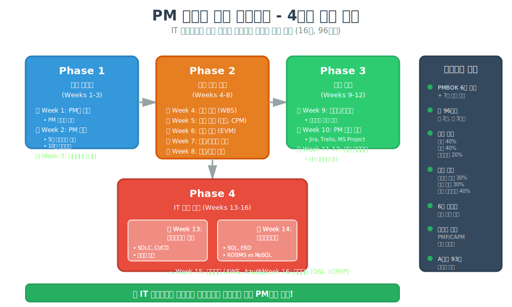

# 🎯 프로젝트 매니저 전문가 양성 프로그램

IT 비전공자를 위한 실무 중심 프로젝트 매니저(PM) 교육 과정

> **⭐ 최신 업데이트 (2025년 2월)**: 
> - **IT교육/PM 전문가 검토 완료!** [전문가 검토 보고서](./docs/evaluations/CURRICULUM_EXPERT_REVIEW_2025_FEB.md) | [검토 요약](./docs/summaries/전문가_검토_요약_2025_02.md) - **A등급(93점) 달성!** ⭐
> - **커리큘럼 재평가 완료!** [종합 평가 보고서](./docs/evaluations/CURRICULUM_COMPREHENSIVE_EVALUATION_2025.md) | [보강 필요 영역 요약](./docs/summaries/보강필요영역_요약.md)
> - **PMBOK 버전 정책 수립!** [버전 정책](./docs/PMBOK_VERSION_POLICY.md) | [분석 보고서](./docs/evaluations/PMP_VERSION_ALIGNMENT_ANALYSIS.md) | [실행 계획](./docs/planning/PMP_VERSION_IMPLEMENTATION_PLAN.md)

---

## 📌 프로그램 소개

이 프로그램은 IT 배경 지식이 없는 분들도 체계적으로 프로젝트 매니저로 성장할 수 있도록 설계된 16주 과정입니다.

> 🎓 **[커리큘럼 오리엔테이션 자료 보기](./curriculum/week00-pm-orientation/week00-pm-orientation_README.md)**  
> PMBOK와 IT 기술(소프트웨어 공학, 보안, 네트워크, DB, 신기술)이 어떻게 연결되어 있는지,  
> 왜 이것들을 공부해야 하는지, 프로젝트 제약조건(범위/일정/비용/품질)을 어떻게 극복하는지 상세히 설명합니다.

## 📚 PMBOK 버전 정책

본 프로그램은 **PMBOK 6th Edition (2017)**을 주요 학습 기반으로 하며, **PMBOK 7th Edition (2021)**의 주요 변화를 보충 자료로 다룹니다.

### 왜 이런 접근법을 선택했나요?

- ✅ **체계적 학습**: 6판의 49개 프로세스와 10대 지식영역으로 PM 기초를 확실히 다집니다
- ✅ **실무 적용**: 대부분의 기업이 여전히 6판 기반 프로세스를 사용합니다
- ✅ **PMP 시험 대비**: 7판의 원칙과 성과 영역을 추가 학습하여 최신 PMP 시험에 완벽 대응합니다
- ✅ **하이브리드 방법론**: 전통적 워터폴과 애자일 방법론을 모두 배웁니다

### 학습 방식
- **Week 1-8**: PMBOK 6판의 49개 프로세스 체계 학습
- **Week 2**: 6판과 7판 상세 비교 (전용 섹션)
- **Week 9**: 애자일/스크럼 (7판의 적응형 접근 포함)
- **자격증 준비**: 7판 기반 PMP 시험 대응 가이드 제공

👉 **[상세 버전 정책 보기](./docs/PMBOK_VERSION_POLICY.md)** | **[분석 보고서](./docs/evaluations/PMP_VERSION_ALIGNMENT_ANALYSIS.md)** | **[실행 계획](./docs/planning/PMP_VERSION_IMPLEMENTATION_PLAN.md)**

### 📊 전문가 평가 결과 (2025년 2월 최신 검토)
**현재 점수**: **93.0/100점 (A등급)** ⭐ | **이전**: 87.5/100점 (B+등급)

**완성도 현황**:
- ✅ **강의 자료**: 100% (16/16 주차) - 모든 콘텐츠 완성
- ✅ **사전 학습 자료**: 100% (16/16) - **전체 완료!** ← 최근 개선
- ✅ **평가 체계**: 100% (30/30) - 루브릭 + 퀴즈 완료
- ✅ **케이스 스터디**: 100% (6/6) - 다양한 산업 커버
- ✅ **실습 가이드**: 100% (4/4) - **GitHub, Jira, AWS, SQL 모두 완료!** ← 최근 개선

**4대 평가 기준 점수**:
- ✅ **완전성 (Completeness)**: 95/100
- ✅ **효율성 (Efficiency)**: 92/100
- ✅ **이해성 (Comprehensibility)**: 94/100
- ✅ **강의용이성 (Ease of Teaching)**: 91/100

**전문가 의견**:
> "IT 비전공자를 위한 PM 교육의 모범 사례로, **즉시 교육 프로그램 운영 가능**한 수준입니다. 국내 최고 수준의 완성도를 갖추었습니다." ⭐⭐⭐⭐⭐

**개선 권장사항** (선택):
- 🟡 **멀티미디어 자료**: 핵심 개념 동영상 (우선순위: 중)
- 🟡 **최신 트렌드**: AI PM, DevSecOps, FinOps (우선순위: 중)
- 🟢 **시각 자료 보강**: GitHub 가이드 스크린샷 (우선순위: 낮)

👉 **[전문가 검토 상세](./docs/evaluations/CURRICULUM_EXPERT_REVIEW_2025_FEB.md)** | **[검토 요약](./docs/summaries/전문가_검토_요약_2025_02.md)** | **[이전 평가](./docs/evaluations/CURRICULUM_COMPREHENSIVE_EVALUATION_2025.md)**

### 🎯 교육 목표
- ✅ 프로젝트 관리 기본 개념부터 실전 적용까지
- ✅ 국제 공인 자격증(PMP, CAPM) 준비
- ✅ 실무에서 바로 사용 가능한 템플릿 및 도구 습득
- ✅ 모의 프로젝트를 통한 실전 경험

---

## 📚 커리큘럼 구성 (총 16주)

### 📊 전체 커리큘럼 구조



### 🗓️ 16주 타임라인


### Phase 0: 오리엔테이션 (시작 전)
| 주차 | 주제 | 핵심 내용 |
|------|------|-----------|
| Week 0 | [프로그램 오리엔테이션](./curriculum/week00-pm-orientation/week00-pm-orientation_README.md) | 통합 학습의 필요성, PMBOK+IT 기술 연계, 제약조건 극복 전략 |

### Phase 1: 기초 다지기 (1-3주)
| 주차 | 주제 | 핵심 내용 |
|------|------|-----------|
| Week 1 | PM의 이해 | PM 역할, 프로젝트 생명주기 |
| Week 2 | 프로젝트 관리 기초 | 5대 프로세스 그룹, 10대 지식영역 |
| Week 3 | 이해관계자 관리 | 커뮤니케이션, 회의 운영, 보고서 작성 |

### Phase 2: 핵심 역량 습득 (4-8주)
| 주차 | 주제 | 핵심 내용 |
|------|------|-----------|
| Week 4 | 범위 관리 | 요구사항 수집, WBS 작성 |
| Week 5 | 일정 관리 | 간트 차트, 크리티컬 패스 |
| Week 6 | 원가 관리 | 예산 수립, EVM |
| Week 7 | 품질 & 리스크 관리 | 품질 통제, 리스크 대응 전략 |
| Week 8 | 자원 & 조달 관리 | 팀 관리, 갈등 해결 |

### Phase 3: 실전 적용 (9-12주)
| 주차 | 주제 | 핵심 내용 |
|------|------|-----------|
| Week 9 | 애자일/스크럼 | 애자일 방법론, 스크럼 프레임워크 |
| Week 10 | PM 도구 활용 | Jira, Trello, MS Project 실습 |
| Week 11-12 | 모의 프로젝트 | 팀별 프로젝트 기획 및 실행 |

### Phase 4: IT 기술 기초 (13-16주)
| 주차 | 주제 | 핵심 내용 |
|------|------|-----------|
| Week 13 | 소프트웨어 공학 | SDLC, 개발 방법론, CI/CD, 테스팅 |
| Week 14 | 데이터베이스 | SQL, 데이터 모델링, RDBMS vs NoSQL |
| Week 15 | 클라우드 컴퓨팅 | AWS, Azure, GCP, 클라우드 아키텍처 |
| Week 16 | 네트워크 | OSI 7계층, TCP/IP, 네트워크 보안 |

---

## 📂 저장소 구조

```
pm-expert-training/
├── README.md                        # 프로그램 소개 및 전체 안내
│
├── curriculum/                      # 📚 주차별 커리큘럼 (Week 0-16)
│   ├── week00-pm-orientation/       # 프로그램 오리엔테이션
│   ├── week01-pm-introduction/      # PM 소개
│   ├── week02-pm-fundamentals/      # PM 기초
│   ├── week03-stakeholder-management/
│   ├── week04-scope-management/
│   ├── week05-schedule-management/
│   ├── week06-cost-management/
│   ├── week07-quality-risk-management/
│   ├── week08-resource-procurement/
│   ├── week09-agile-scrum/
│   ├── week10-pm-tools/
│   ├── week11-12-mock-project/
│   ├── week13-software-engineering/
│   ├── week14-database/
│   ├── week15-cloud/
│   └── week16-network/
│
├── assessment/                      # 📝 평가 자료
│   ├── quizzes/                     # 주차별 퀴즈
│   └── rubrics/                     # 주차별 평가 기준
│
├── case-studies/                    # 💼 실습 케이스 스터디
│   ├── case01-mobile-app-dev.md
│   ├── case02-marketing-campaign.md
│   ├── case03-office-relocation.md
│   ├── case04-erp-implementation.md
│   ├── case05-product-launch.md
│   └── case06-ai-chatbot-project.md
│
├── templates/                       # 📋 실무 템플릿
│   ├── project-charter.md
│   ├── wbs-template.md
│   ├── gantt-chart-template.md
│   ├── risk-register.md
│   ├── meeting-minutes.md
│   └── status-report.md
│
├── guides/                          # 📖 실습 가이드
│   ├── jira-setup-guide.md
│   ├── github-setup-guide.md
│   ├── aws-free-tier-guide.md
│   ├── sql-practice-guide.md
│   ├── pm-glossary.md
│   ├── pmbok-summary.md
│   ├── pmbok-6th-to-7th-mapping.md
│   └── checklists.md
│
├── resources/                       # 🔗 참고 자료
│   ├── recommended-books.md
│   ├── certification-guide.md
│   └── useful-links.md
│
└── docs/                            # 📄 프로그램 관리 문서
    ├── PMBOK_VERSION_POLICY.md      # PMBOK 버전 정책
    ├── PMP_버전_정렬_요약.md
    ├── evaluations/                 # 커리큘럼 평가 보고서
    ├── planning/                    # 개발 계획 및 로드맵
    └── summaries/                   # 프로그램 요약 문서
```

---

## 🛠️ 교육 방법론

- **이론 강의**: 40% - 핵심 개념 이해
- **실습/워크샵**: 40% - 도구 활용 및 문서 작성
- **그룹 프로젝트**: 20% - 실전 시뮬레이션

---

## 📊 평가 및 수료

### 평가 방법
- 주차별 퀴즈: 30%
- 중간 과제 (문서 작성): 30%
- 최종 프로젝트 발표: 40%

### 수료 조건
- ✅ 출석률 80% 이상
- ✅ 종합 평가 70점 이상

### 수료 혜택
- 🎓 수료증 발급
- 📚 PMP/CAPM 자격증 준비 가이드
- 🤝 3개월 멘토링 프로그램

---

## 💼 수강 대상

- IT 비전공자
- 타 분야에서 PM으로 전환 희망자
- 신입/주니어 PM
- 프로젝트 관리 역량 강화가 필요한 실무자

---

## 📅 운영 정보

- **정원**: 20-25명 (소규모 집중 교육)
- **일정**: 주 2회 (화/목) 저녁 7-10시 또는 주말 집중 과정
- **기간**: 16주 (총 96시간)

---

## 📞 문의

프로그램 관련 문의사항은 이슈(Issue)로 등록해주세요.

### 📚 주요 문서

#### 최신 전문가 검토 (2025년 2월)
- **[IT교육/PM 전문가 검토 보고서](./docs/evaluations/CURRICULUM_EXPERT_REVIEW_2025_FEB.md)** ⭐ 최신 - 완전성, 효율성, 이해성, 강의용이성 평가 (A등급 93점)
- **[전문가 검토 요약](./docs/summaries/전문가_검토_요약_2025_02.md)** - 핵심 요약 및 권장사항

#### PMBOK 버전 정책
- **[PMBOK 버전 정책](./docs/PMBOK_VERSION_POLICY.md)** - 6판/7판 학습 전략
- **[PMP 버전 정렬 요약](./docs/PMP_버전_정렬_요약.md)** - 한국어 요약

#### 평가 보고서
- **[종합 평가 보고서](./docs/evaluations/CURRICULUM_COMPREHENSIVE_EVALUATION_2025.md)** - 전체 커리큘럼 상세 분석 (이전 평가)
- **[커리큘럼 재평가](./docs/evaluations/CURRICULUM_RE-EVALUATION_2025.md)** - 충분성, 완전성, 이해성, 효율성 평가
- **[평가 비교 분석](./docs/evaluations/EVALUATION_COMPARISON.md)** - 초기 vs 재평가 비교
- **[초기 평가 보고서](./docs/evaluations/CURRICULUM_EVALUATION.md)** - 전문가 평가 및 개선 제안

#### 개발 계획
- **[실행 로드맵](./docs/planning/IMPLEMENTATION_ROADMAP.md)** - 단계별 개선 계획
- **[잔여 작업 상세](./docs/planning/REMAINING_TASKS.md)** - 전체 작업 목록 및 실행 가이드
- **[액션 플랜](./docs/planning/ACTION_PLAN_2025.md)** - 2025년 개선 계획

#### 프로그램 요약
- **[커리큘럼 전체 요약](./docs/summaries/커리큘럼_전체_요약.md)** - 16주 과정 전체 개요
- **[보강 필요 영역](./docs/summaries/보강필요영역_요약.md)** - 핵심 보강사항
- **[보강 현황 한눈에 보기](./docs/summaries/보강현황_한눈에보기.md)** - 진행 상황
- **[요약 보고서](./docs/summaries/SUMMARY_REPORT.md)** - Executive Summary

### 🎓 샘플 콘텐츠
- **[Week 5 상세 강의 자료](./curriculum/week05-schedule-management/detailed-lecture-materials.md)** - CPM, PERT, 간트 차트
- **[Jira 실습 가이드](./guides/jira-setup-guide.md)** - 무료 계정부터 프로젝트 완성까지
- **[AI 챗봇 케이스 스터디](./case-studies/case06-ai-chatbot-project.md)** - AI/ML 프로젝트 관리

---

## 📜 라이선스

이 교육 자료는 학습 목적으로 자유롭게 사용 가능합니다.

---

**🚀 함께 성장하는 PM 전문가가 되어보세요!**