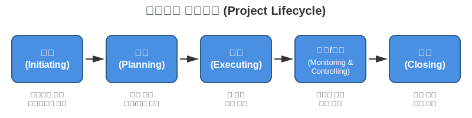

# Week 1: PM의 이해

---

> **📚 PMBOK 버전**: 이 자료는 PMBOK 6th Edition을 기반으로 하며,  
> 7th Edition의 주요 변화를 추가로 다룹니다.  
> 👉 [상세 버전 정책 보기](../../PMBOK_VERSION_POLICY.md)

---

## 📝 학습 목표
- 프로젝트 매니저의 역할과 책임 이해
- 프로젝트와 일반 업무의 차이점 파악
- 프로젝트 생명주기의 단계별 특성 학습

## 📚 주요 내용

### 1. 프로젝트 매니저란?


- **정의**: 프로젝트의 목표를 달성하기 위해 팀과 자원을 관리하는 전문가
- **핵심 역할**:
  - 프로젝트 계획 수립 및 실행
  - 팀 조율 및 의사소통 관리
  - 일정, 예산, 범위 관리
  - 리스크 식별 및 대응
  - 이해관계자 관리

### 2. 프로젝트 vs 운영 업무
| 구분 | 프로젝트 | 운영 업무 |
|------|----------|-----------|
| 기간 | 한시적 (시작과 종료가 명확) | 지속적 |
| 목표 | 고유한 결과물 창출 | 기존 서비스/제품 유지 |
| 팀 구성 | 임시 조직 | 영구 조직 |
| 예산 | 프로젝트별 배정 | 부서별 운영 예산 |

### 3. 프로젝트 생명주기



#### 3.1 착수 단계
- 프로젝트 헌장 작성
- 주요 이해관계자 식별
- 고수준 요구사항 정의

#### 3.2 계획 단계
- 상세 범위 정의
- 일정 및 예산 수립
- 리스크 관리 계획
- 커뮤니케이션 계획

#### 3.3 실행 단계
- 계획된 활동 수행
- 팀 관리 및 조율
- 품질 보증
- 정보 배포

#### 3.4 감시/통제 단계
- 진척도 추적
- 변경 관리
- 이슈 및 리스크 관리
- 성과 보고

#### 3.5 종료 단계
- 최종 인도물 전달
- 문서화 및 교훈 정리
- 계약 종료
- 팀 해산

## 🎯 실무 적용 예시: 다양한 조직 환경에서의 PM 역할

### 예시 1: 스타트업 vs 대기업 PM 비교

#### 스타트업 PM (50명 규모, 모바일 앱 개발)

**프로젝트**: AI 기반 헬스케어 앱 런칭

```
PM의 역할과 일상:

09:00 - 스탠드업 미팅 (15분)
  - 개발팀 5명과 진행 상황 공유
  - 어제 완료, 오늘 계획, 블로커 확인
  - 기술적 논의: "이 API가 왜 느린가요?" → 즉시 해결 방안 논의

10:00 - 제품 기획 회의
  - CEO와 직접 소통
  - "사용자 피드백 보니 이 기능 빼고 저걸 넣어야겠어요"
  - 즉시 결정, 즉시 실행

11:00 - 개발자와 1:1 기술 논의
  - "React Native vs Flutter, 뭐가 나을까요?"
  - PM도 기술 이해 필요: 성능, 개발 속도, 유지보수성 비교

14:00 - 디자이너와 UI/UX 리뷰
  - "이 버튼 위치가 사용자 테스트에서 문제됐어요"
  - 실시간 수정, 즉시 반영

15:00 - 투자자 미팅 준비
  - KPI 정리: DAU, 리텐션, 전환율
  - 기술 아키텍처 설명 (AWS 구조도)
  - MVP 런칭 일정 설명

17:00 - 버그 수정 우선순위 회의
  - "이 버그는 5% 유저만 겪지만 치명적이에요"
  - 기술 영향도 이해 필요: "API 변경하면 앱도 업데이트 필요"

특징:
✅ 빠른 의사결정 (CEO와 직접 소통)
✅ 다재다능 (기획, 개발, 마케팅 모두 관여)
✅ 기술 깊이 필요 (개발자와 긴밀한 협업)
❌ 프로세스 부족 (문서화 약함)
❌ 리소스 제약 (예산, 인력 부족)
```

#### 대기업 PM (1,000명 규모, 금융 시스템 개발)

**프로젝트**: 차세대 모바일 뱅킹 시스템 구축

```
PM의 역할과 일상:

09:00 - 일일 진행 회의 (30분)
  - 20개 팀 대표 참석 (프론트, 백엔드, DB, 인프라, 보안, QA...)
  - 엑셀 대시보드 리뷰: Red/Yellow/Green 상태
  - 이슈 에스컬레이션: "DB 마이그레이션 3일 지연"

10:00 - 변경 통제 위원회 (CCB)
  - "A은행 요구사항 변경: 생체인증 추가"
  - 영향도 분석 보고서 검토 (50페이지)
  - 승인 프로세스: 5단계 결재

11:30 - 위험 관리 회의
  - 리스크 레지스터 업데이트 (100개 항목)
  - "외부 PG사 API 지연 가능성" → 대응 계획 수립
  - 보안 감사 일정 조율

14:00 - 경영진 보고 준비
  - PPT 50장 작성
  - 일정: 간트 차트 (200개 태스크)
  - 예산: EVM 지표 (CPI, SPI)
  - 리스크: Top 10 이슈

15:30 - 공급업체 관리
  - 외주 개발사 3곳과 진행 리뷰
  - 계약 변경 협상
  - SLA(Service Level Agreement) 준수 여부 확인

17:00 - 문서 작성
  - 주간 상태 보고서 (10페이지)
  - 이슈 로그 업데이트
  - 회의록 정리 및 배포

특징:
✅ 명확한 프로세스 (표준화된 문서, 승인 체계)
✅ 충분한 리소스 (예산, 인력)
✅ 체계적 위험 관리
❌ 느린 의사결정 (다단계 승인)
❌ 관료주의 (문서 작업 과다)
❌ 혁신 어려움 (규제, 레거시 시스템)
```

### 예시 2: 프로젝트 vs 운영 업무 구분 (실무 사례)

#### 사례 A: 온라인 쇼핑몰 구축

```
분석:
- 시작: 2024년 1월
- 종료: 2024년 6월 (6개월)
- 목표: 새로운 쇼핑몰 플랫폼 런칭
- 팀: 임시 조직 (개발자 10명, 디자이너 2명, PM 1명)
- 예산: $500,000 (프로젝트 전용)
- 결과물: 고유한 쇼핑몰 시스템

판정: ✅ 프로젝트
이유:
- 명확한 시작과 종료
- 고유한 결과물 (기존에 없던 시스템)
- 임시 팀 구성
- 프로젝트 전용 예산
```

#### 사례 B: 쇼핑몰 운영 및 유지보수

```
분석:
- 시작: 2024년 7월
- 종료: 없음 (지속적)
- 목표: 쇼핑몰 안정적 운영
- 팀: 영구 조직 (운영팀 5명)
- 예산: 부서 운영 예산 (월 $10,000)
- 활동:
  - 일일 모니터링
  - 버그 수정
  - 소규모 개선
  - 고객 문의 대응

판정: ❌ 운영 업무
이유:
- 종료일 없음 (계속 운영)
- 반복적 작업
- 영구 조직
- 기존 시스템 유지
```

#### 사례 C: 쇼핑몰 v2.0 업그레이드

```
분석:
- 시작: 2025년 1월
- 종료: 2025년 4월 (3개월)
- 목표: AI 추천 기능 추가
- 팀: 임시 TF (기존 운영팀 + 외부 ML 엔지니어 3명)
- 예산: $200,000 (프로젝트 전용)
- 결과물: 새로운 AI 추천 엔진

판정: ✅ 프로젝트
이유:
- 명확한 목표와 기간
- 고유한 기능 개발
- 임시 조직 (TF)
- 별도 예산

PM의 역할 전환:
운영 PM (유지보수) → 프로젝트 PM (업그레이드) → 운영 PM (v2.0 운영)
```

### 예시 3: IT PM의 기술 이해 필요성 (실전 시나리오)

#### 상황: 갑작스런 시스템 다운

```
15:00 - 모니터링 알람
"Production 서버 CPU 100%, 응답 없음"

❌ 기술 지식 없는 PM:
PM: "서버가 다운됐대요. 얼마나 걸리나요?"
개발자: "원인 파악 중입니다..."
PM: "빨리 고쳐주세요!"
개발자: "..." (답답함)
→ 2시간 후 복구, PM은 아무것도 못함

✅ 기술 지식 있는 PM:
15:05 - 즉시 상황 파악
PM: "CloudWatch 보니 DB 커넥션 풀이 고갈됐네요."
개발자: "맞습니다. 느린 쿼리 때문인 것 같습니다."

PM: "긴급 조치:
1. Auto Scaling으로 서버 2대 추가 (5분)
2. 느린 쿼리 임시 비활성화 (3분)
3. DB 커넥션 풀 사이즈 증가 (1분)"

개발자: "즉시 진행하겠습니다!"

15:20 - 서비스 복구 (15분 만에)

15:30 - 근본 원인 분석
PM: "slow query log 확인해서 인덱스 추가하고,
     다음 배포 때 쿼리 최적화 반영합시다.
     재발 방지 위해 DB 성능 모니터링 알람도 추가해주세요."

16:00 - 경영진 보고
PM: "15:00 장애 발생, 15:20 복구 완료.
     영향: 20분간 서비스 중단
     원인: 비효율적 DB 쿼리
     조치: 쿼리 최적화 + 모니터링 강화
     재발 방지: 인덱스 추가, 성능 테스트 강화"

경영진: "신속한 대응 감사합니다."

차이점:
- 기술 이해 → 빠른 의사결정
- 구체적 지시 → 팀 신뢰 확보
- 근본 원인 파악 → 재발 방지
```

### 예시 4: 프로젝트 생명주기 실전 적용 (API 서비스 개발)

#### 1단계: 착수 (1주)

```
프로젝트 헌장 작성:

프로젝트명: 결제 API 서비스 개발
스폰서: CTO
PM: 김철수
예산: $100,000
기간: 3개월

목표:
- 외부 판매자가 사용할 결제 API 제공
- 일 10만 건 처리 가능
- 응답 시간 < 200ms

주요 이해관계자:
- 내부: 개발팀, 인프라팀, 보안팀
- 외부: 파트너사 3곳

고수준 요구사항:
- RESTful API (JSON)
- 인증: OAuth 2.0
- 결제 수단: 카드, 계좌이체, 간편결제
```

#### 2단계: 계획 (2주)

```
상세 계획 수립:

범위 관리:
- WBS 작성 (30개 작업 패키지)
- API 엔드포인트 15개 정의
- DB 테이블 8개 설계

일정 관리:
- 간트 차트 작성
- 크리티컬 패스: 인증 모듈 → 결제 로직 → 테스트
- 마일스톤: M1(설계 완료), M2(개발 완료), M3(런칭)

예산 관리:
- 인건비: $70,000 (개발자 3명 × 3개월)
- 인프라: $20,000 (AWS)
- 외부 서비스: $10,000 (PG사 연동)

리스크 관리:
- 리스크 1: PG사 API 문서 불명확
  → 대응: 사전 PoC 진행
- 리스크 2: 보안 검토 지연
  → 대응: 보안팀 조기 참여
```

#### 3단계: 실행 (10주)

```
실제 작업 수행:

Week 1-2: 설계
- API 스펙 작성 (Swagger)
- DB 스키마 설계 (ERD)
- 시스템 아키텍처 (AWS 구성도)

Week 3-8: 개발
- 백엔드 API 개발 (Node.js)
- 인증/인가 구현 (JWT)
- 결제 로직 구현
- PG사 연동 (이니시스, 토스페이먼츠)
- 단위 테스트 (Jest)

Week 9-10: 테스트
- 통합 테스트
- 성능 테스트 (JMeter)
- 보안 테스트 (OWASP ZAP)

PM의 일일 활동:
- 09:00: 스탠드업 미팅
- 10:00: 이슈 해결 (블로커 제거)
- 14:00: 진척도 업데이트 (Jira)
- 15:00: 이해관계자 커뮤니케이션
- 17:00: 내일 계획 수립
```

#### 4단계: 감시 및 통제 (진행 중 지속)

```
성과 측정 및 통제:

Week 5 (중간 점검):
- 계획 진척률: 50%
- 실제 진척률: 45% (5% 지연)
- 예산 집행: $40,000 (계획: $50,000, 10% 절감)

원인 분석:
- 지연: PG사 API 문서 불명확 (예상한 리스크 발생)
- 절감: 개발자 생산성 높음

조치:
- PG사와 긴급 미팅 → 문서 명확화
- 일정 회복 계획: 토요일 추가 근무 (보상 휴가)
- 예산 여유분으로 보안 컨설팅 강화

변경 관리:
- 변경 요청: "간편결제 중 네이버페이 추가"
- 영향도: +1주, +$5,000
- 결정: 승인 (예산 여유 활용)
```

#### 5단계: 종료 (1주)

```
프로젝트 마무리:

최종 인도물:
✅ API 서비스 (Production 배포)
✅ API 문서 (Swagger UI)
✅ 개발자 가이드
✅ 운영 매뉴얼
✅ 소스 코드 (GitHub)

교훈 정리:
✅ 잘한 점:
- 보안팀 조기 참여로 취약점 사전 예방
- PG사 PoC로 기술 검증

❌ 개선 필요:
- API 스펙 변경 횟수 많음 → 사전 리뷰 강화
- 성능 테스트 늦게 시작 → 개발 중반부터 진행

성과 보고:
- 목표 대비 달성률: 105%
- 일정: 1주 지연 (예상 리스크)
- 예산: 95% 집행 (5% 절감)
- 품질: 보안 취약점 0건, 성능 목표 초과 달성

팀 해산 및 이관:
- 개발팀 → 다음 프로젝트 배정
- API 운영 → 플랫폼팀 이관
- 후속 지원: 1개월간 PM이 기술 지원
```

## 💡 실습 과제

### 과제 1: PM 역할 이해하기
성공한 프로젝트 사례를 찾아 PM의 역할을 분석하고 보고서 작성 (A4 1페이지)

### 과제 2: 프로젝트 구분하기
본인이 경험한 업무 중 3가지를 선정하여 프로젝트인지 운영 업무인지 구분하고 근거 제시

## 📖 참고 자료
- PMBOK Guide Chapter 1-2
- "The Art of Project Management" by Scott Berkun
- PMI 공식 웹사이트: https://www.pmi.org

## ✅ 자가 점검 퀴즈

1. 프로젝트의 3가지 핵심 제약 조건은?
2. 프로젝트 생명주기의 5단계를 순서대로 나열하시오.
3. PM의 핵심 역량 3가지는?

## 📝 핵심 용어
- **프로젝트 (Project)**: 고유한 제품, 서비스, 결과를 만들기 위한 한시적 노력
- **프로젝트 매니저 (PM)**: 프로젝트 목표 달성을 책임지는 리더
- **프로젝트 헌장 (Project Charter)**: 프로젝트를 공식적으로 승인하는 문서
- **이해관계자 (Stakeholder)**: 프로젝트에 영향을 주거나 받는 개인/조직
- **Triple Constraint**: 범위, 일정, 원가의 3대 제약 조건

## 다음 주 예고
Week 2에서는 PMBOK의 5대 프로세스 그룹과 10대 지식영역을 상세히 학습합니다.
